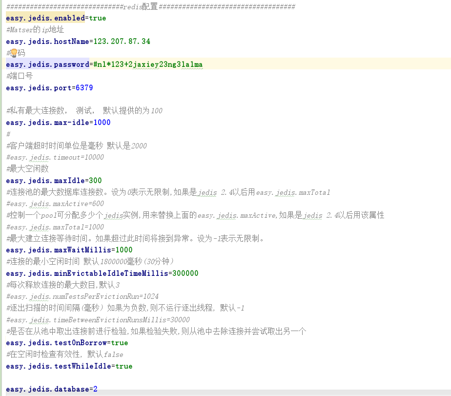
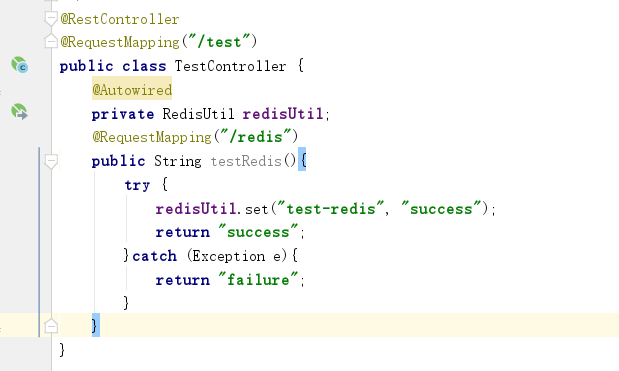

##easyjedis

#####1.配置文件

            做这么个easyjedis的主要原因有：1.学习自定义 starter。2.考虑到Spring时期集成redis每次需要重复配置。在学习过程中，遇到了挺多不解的之处。
        最大的疑问是META-INF下的spring-configuration-metadata 及additional-spring-configuration-metadata两个文件。我做easyjedis是为了提供常用的默
        认配置的同时允许用户进行私有配置（重写配置），因此在主观意愿下，误解了上述两个文件中的defaultValue的含义。国内深入研究这两个文件的博客很少，
        大部分只是对springboot官网的demo做了个翻译。<a>https://docs.spring.io/spring-boot/docs/1.3.1.RELEASE/reference/html/configuration-metadata.html</a>
        后来通过google 找到了一篇好文<a>https://docs.spring.io/spring-boot/docs/1.3.1.RELEASE/reference/html/configuration-metadata.html</a> 通过这
        个文章我理解了上述两个文件的作用！
    
#####2.springboot的自动化配置

        在研究如何提供自动化配置（默认配置+用户自由配置）的时候，看了源码。发现spring-boot-autoconfigure包简直是全家桶呀！几乎集成了web开发中
    可能会涉及的所有第三方工具包和包括数据库、中间件等java客户端的所有常用配置！redis template 相关配置也有了，而且比我实现的优美多了！有时间
    多多学习！同时也终于学会了starter提供默认配置的方式，就是声明时赋初始值，我想太多了~~呜呜！
    
##使用方式

1.引入jar包。

            <dependency>
                <groupId>cn.runtheworld</groupId>
                <artifactId>easy-jedis-spring-boot-starter</artifactId>
                <version>1.0.0</version>
            </dependency>
            
            ps:我还得学学如何deploy一个maven项目。。。现在只能本地使用
            
2.在application.properties 中设置easy.jedis.enabled=true（多余的）。  
配置好redis 的hostname、password、port等信息就好。  
还有redispool相关属性可以配置。如图：

3.RedisUtil  
需要操作redis的地方，注入RedisUtil即可。  

##自定义starter的步骤（待完善...）

##写在最后

        springboot是个强大灵活的脚手架。之前只是简单地使用springboot进行了项目开发，没有深入研究。
    这是第一次在github上尝试分享些东西，没多大技术含量，也还有很多不完善的地方。尝试迈开第一步
    总是好的，加油！